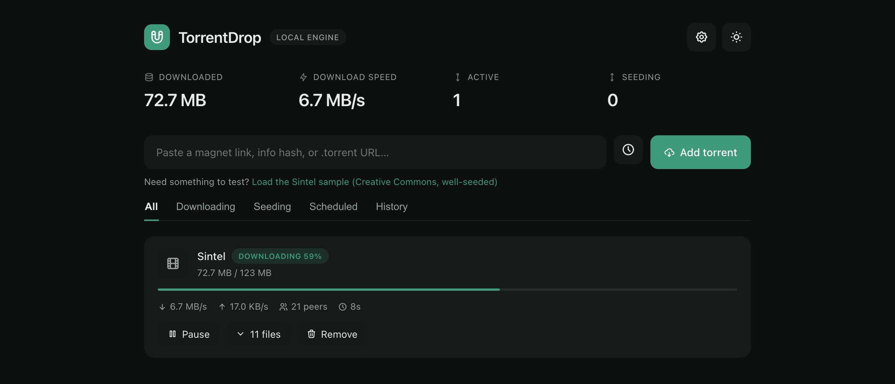
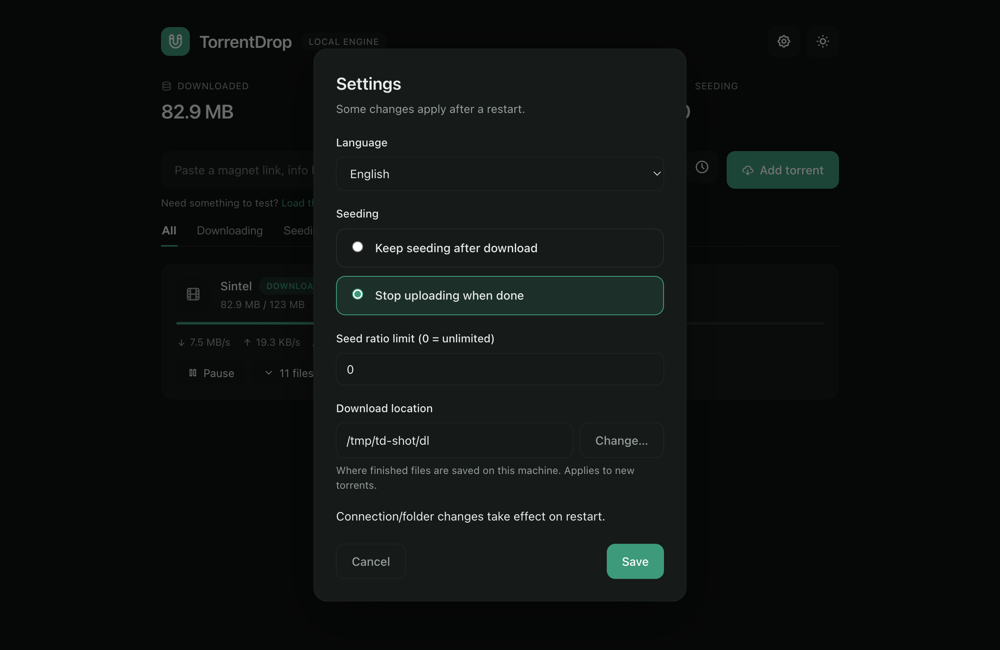

<p align="center">
  
</p>

<h1 align="center">TorrentDrop</h1>

<p align="center">
  A clean desktop torrent client — paste a magnet link, download from the full
  BitTorrent swarm, and keep everything on your own machine.
</p>

<p align="center">
  
  
  
  
</p>

<p align="center">
  
</p>

TorrentDrop is a small [WebTorrent](https://webtorrent.io/) engine (Node) that does the real peer work — TCP, uTP, DHT, PEX, and web seeds — wrapped in an Electron window. There is no third-party server and nothing leaves your device. The same engine can also run headless and be served over HTTP if you'd rather self-host.

## Features

- **Add anything** — magnet link, 40-char hex / base32 info hash, or `.torrent` URL
- **Full-swarm peer discovery** — DHT, LSD, PEX, UDP/HTTP/WSS trackers, with UPnP/NAT-PMP port mapping
- **Resumable downloads** — sequential, HTTP range-based; restarts pick up where they left off
- **Seeding control** — keep seeding, stop when done, or stop at a share ratio
- **Scheduled downloads** — queue a link to start at a chosen time
- **Download history** — see everything you've finished
- **Background run** — lives in the macOS menu bar / Windows system tray with live speed
- **8-language UI** — English, Español, Français, Deutsch, Português, العربية, 中文, हिन्दी (with RTL)
- **Light & dark themes**

## Install

Download the build for your platform from the [Releases](https://github.com/GDP07/torrent-drop/releases) page.

- **macOS** — open the `.dmg` and drag TorrentDrop to Applications.
- **Windows** — run `TorrentDrop Setup x.y.z.exe` (installer) or `TorrentDrop x.y.z.exe` (portable, no install).

### First launch (unsigned builds)

The released builds aren't signed with a paid certificate, so your OS warns you the first time:

- **macOS** — right-click the app → **Open** → **Open**. If macOS says it's "damaged", clear the download flag once:
  ```bash
  xattr -dr com.apple.quarantine /Applications/TorrentDrop.app
  ```
- **Windows** — on the SmartScreen prompt, click **More info** → **Run anyway**.

This is expected for unsigned open-source apps. See [docs/SIGNING.md](docs/SIGNING.md) for how to sign releases.

## Screenshots

<p align="center">
  
</p>

## Quick start (from source)

Requires [Node.js](https://nodejs.org/) 18+.

```bash
npm install
npm run desktop      # launch the desktop app
```

Or run just the engine and open the UI in a browser:

```bash
npm start            # serves the UI at http://localhost:8080
```

## Desktop builds

```bash
npm run dist:mac     # macOS .dmg + .zip (arm64 + x64)
npm run dist:win     # Windows installer + portable .exe
npm run dist:all     # both
```

Builds land in `dist/`. See [docs/BUILDING.md](docs/BUILDING.md) for details.

## Self-hosting the engine

The engine can run on a server and stream finished files to a browser. This is optional and comes with real bandwidth and legal responsibility — see [docs/SELF-HOSTING.md](docs/SELF-HOSTING.md). Set `TD_PASSWORD` before exposing it to the internet.

## Configuration

Settings live in a JSON file in your user-data directory (`~/.torrentdrop/config.json` for the CLI; the app's user-data folder for the desktop build) and are editable in-app. The engine also reads a few environment variables:

| Variable | Default | Description |
| --- | --- | --- |
| `PORT` | `8080` | HTTP port for the UI/API |
| `TD_HOST` | `0.0.0.0` | Bind address (the desktop app uses `127.0.0.1`) |
| `TD_PASSWORD` | _(empty)_ | Require a login; mandatory before exposing to the internet |
| `TD_DOWNLOAD_DIR` | `./downloads` | Default download folder |
| `MAX_CONNS` | `1000` | Max peers per torrent |
| `TORRENT_PORT` | `6881` | Listening port for incoming peers (forward this for best speed) |

## Project layout

```
server.js            # the WebTorrent engine + HTTP/API
public/index.html    # the UI (served by the engine)
electron/            # desktop wrapper (main process, preload, tray assets)
build/               # packaging hooks + icon generators
examples/            # standalone browser-only variant
docs/                # building, self-hosting, signing guides
```

## Tips for faster downloads

Torrent speed depends on how many seeders exist and whether peers can reach you. The biggest lever is **forwarding TCP + UDP port 6881** to your machine (the app attempts this automatically via UPnP/NAT-PMP). A download is only ever as fast as the swarm can feed it — your internet speed is the ceiling, not a guarantee.

## Legal & responsible use

TorrentDrop is a general-purpose BitTorrent client, like the many before it. BitTorrent is widely used to distribute Linux ISOs, game assets, scientific datasets, and other legitimate content. You are responsible for complying with the laws in your jurisdiction and for only downloading or sharing content you're authorized to. The authors do not condone copyright infringement.

## Contributing

Issues and pull requests are welcome. See [CONTRIBUTING.md](CONTRIBUTING.md).

## License

[MIT](LICENSE)
